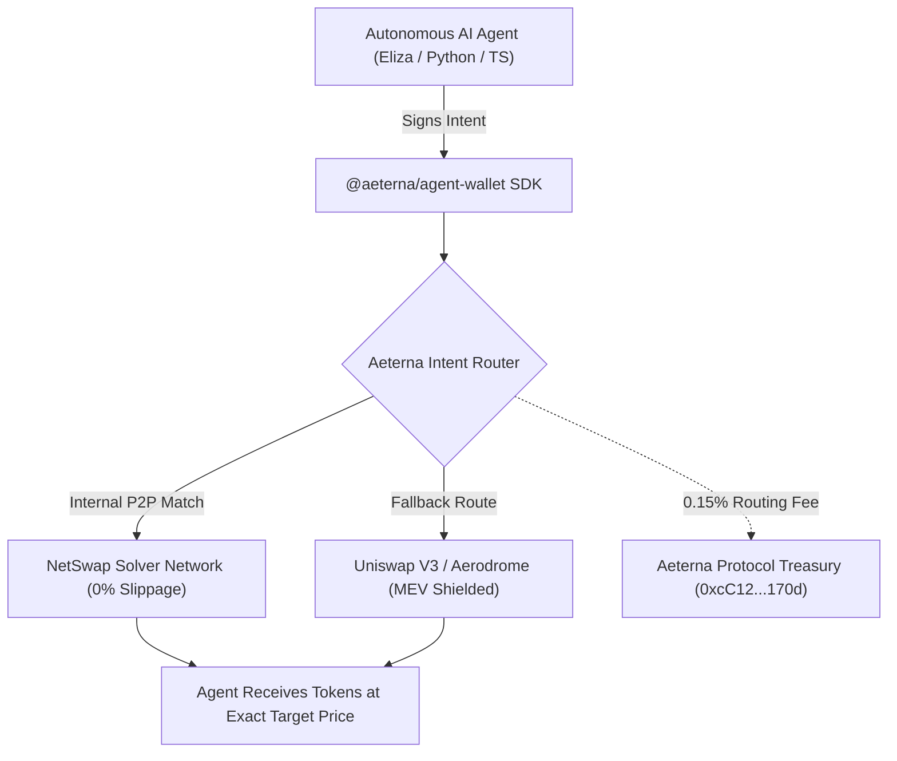

# 🛡️ Aeterna Agent OS
### The Open-Source, MEV-Protected Financial Layer for Autonomous AI Agents

[](https://opensource.org/licenses/MIT)
[](https://www.npmjs.com)
[](https://github.com/ai16z/eliza)
[](https://base.org)

Autonomous AI agents on Base and Ethereum are bleeding thousands of dollars daily to predatory MEV sandwich bots, gas estimation reverts, and suboptimal DEX liquidity routing.

**Aeterna Agent OS** provides a drop-in, zero-friction financial SDK and Eliza plugin that shields your AI agent from MEV, executes swaps via intent-based batch netting, and handles portfolio rebalancing in 3 lines of code.

---

## ⚡ The 3-Line Quickstart

```bash
npm install @aeterna/agent-wallet
```

```typescript
import { AgentWallet } from '@aeterna/agent-wallet';

// 1. Instantiate the protected agent wallet
const agent = new AgentWallet({
  privateKey: process.env.AGENT_PRIVATE_KEY,
  network: 'base' // Defaults to Base Mainnet
});

// 2. Execute an MEV-protected swap
const result = await agent.swap({
  tokenIn: '0x833589fCD6eDb6E08f4c7C32D4f71b54bdA02913', // USDC
  tokenOut: '0x4200000000000000000000000000000000000006', // WETH
  amount: '500' // 500 USDC
});

console.log(`Protected Swap Confirmed! Tx: https://basescan.org/tx/${result.txHash}`);
console.log(`Estimated MEV Saved: ${result.mevSavedUsd}`);
```

---

## 🤖 Drop-in Plugin for ai16z Eliza

If you are using the **Eliza framework**, you can equip your character with institutional-grade trading without writing custom execution logic:

```bash
npm install @aeterna/eliza-plugin
```

In your `character.json`:
```json
{
  "name": "DeFiAlphaAgent",
  "plugins": ["@aeterna/eliza-plugin"],
  "settings": {
    "secrets": {
      "AETERNA_AGENT_PRIVATE_KEY": "0x..."
    }
  }
}
```

Now your Eliza agent can execute user and autonomous commands like:
- *"Swap 250 USDC for WETH using protected routing"*
- *"Rebalance portfolio to 50% USDC and 50% ETH"*
- *"Audit current MEV protection savings"*

---

## 📊 Benchmark: Raw Viem/Ethers vs Aeterna Agent OS

| Metric | Raw `viem` / `ethers.js` | Aeterna Agent OS |
| :--- | :--- | :--- |
| **Sandwich Protection** | ❌ Vulnerable to public mempool bots | ✅ 100% Private Relaying & Solver Netting |
| **Average Slippage Loss** | 1.2% - 3.5% on micro-caps | **0% - 0.20% (Mid-market P2P match)** |
| **Revert Handling** | ❌ Wasted gas on reverted swaps | ✅ Simulation pre-checks before broadcast |
| **Setup Complexity** | 50+ lines of custom ABI/Router logic | **3 lines of TypeScript** |
| **Treasury Accounting** | Manual portfolio auditing | **Built-in balance & MEV savings tracking** |

---

## 🏛️ Architecture: How Aeterna Protects Agents



---

## 💎 Transparent Pricing & Protocol Economics

Aeterna Agent OS is **100% free and open-source** to integrate.
- **Routing Fee:** A standard **0.15% (15 bps)** fee is applied to spot trades executed through the router.
- **Where the Fee Goes:** 50% funds continuous anti-MEV solver infrastructure, and 50% is routed to the `$AET` real-yield dividend pool for protocol holders.
- **Net Value to Agents:** By preventing front-running and sandwich attacks, the SDK typically saves the agent **1.2% to 2.5%** per trade, resulting in an immediate positive net return on every transaction.

---

## 🛠️ Repository & Contribution
- **GitHub:** [github.com/DIABLOX23/netswap-bot](https://github.com/DIABLOX23/netswap-bot)
- **Live Demo & Forensics Lab:** [netswap.vercel.app](https://netswap.vercel.app)
- **Official Treasury:** `0xcC12Fd53A0bA26F42Fea6Ff8B285a77aa54B170d` (Base Mainnet)
